# Hummingbot Backtesting API & Dashboard  
[](https://hub.docker.com/r/hummingbot/backend-api)
[](LICENSE)

---

A batteries-included FastAPI service for **parameter-sweep back-testing** of Hummingbot V2 strategies – complete with a hot-reload dev loop, Makefile helpers, and a Tailwind-styled Streamlit dashboard for deep-dive analysis.

> Run a whole sweep in one command, watch results populate live, then drill down from batch KPIs to individual trades — all on your laptop.

---

## Table of Contents
1. [Key Features](#key-features)
2. [Prerequisites](#prerequisites)
3. [Quick Start](#quick-start)
4. [Architecture Overview](#architecture-overview)
5. [OS-Specific Setup Notes](#os-specific-setup-notes)
6. [Makefile Cheat-Sheet](#makefile-cheat-sheet)
7. [Docker Commands Cheat-Sheet](#docker-commands-cheat-sheet)
8. [Sweep / Testing Pipeline](#sweep--testing-pipeline)
9. [Dashboard](#dashboard)
10. [Repository Layout](#repository-layout)
11. [Developer Workflow](#developer-workflow)
12. [Troubleshooting](#troubleshooting-docker-quirks)
13. [Contributing](#contributing)
14. [License](#license)

---

## Key Features
• **One-click builds** – Idempotent patch loop fixes upstream Hummingbot bugs on build.  
• **Docker-first** – Clean container with hot-reload (`uvicorn --reload`).  
• **Parameter sweeps** – YAML → JSON payloads → parallel back-tests (ThreadPool).  
• **Candles cache** – Local Parquet store eliminates exchange rate-limits.  
• **Streamlit dashboard** – *Analyst's Funnel* flow (Batch → Leaderboard → Trade Inspector).  
• **Makefile helpers** – Common tasks wrapped in sensible targets.  
• **Smoke / UI tests** – `quick_smoke.py` & Playwright headless test keep CI green.

---

## Prerequisites
• Docker 23+ (Desktop or CLI) with the `docker compose` plugin  
• Python 3.10+ on the **host** for the Streamlit dashboard & helper scripts  
• `make` 4.3+ for convenience targets (optional)  
• Windows users: enable WSL2 and turn on Docker ↔ WSL integration  
• If you plan to run dashboard/scripts outside Conda, install deps: `pip install -r requirements.txt`  
• Local runs (no Docker) read environment vars from `.env`; copy `.env.example` → `.env` and tweak ports/keys

---

## Quick Start
### 1 – Docker (Recommended)
```bash
# Build and start backend API & broker
docker compose up -d --build  # http://localhost:8000/docs

# Follow logs (optional)
docker compose logs -f backend-api | cat
```
### 2 – Run the Dashboard
Requires host Python 3.10+ (no Conda necessary):
```bash
# install dependencies once (inside WSL / your host shell)
pip install -r requirements.txt

python3 scripts/dev_watch.py   # typically opens http://localhost:8501
```
The watcher runs Python & UI smoke tests first, then launches Streamlit with **auto-reload**.

### 3 – (Optional) Local Conda Env
```bash
conda env create -f environment.yml
conda activate backend-api
uvicorn main:app --reload
```

---

## Architecture Overview


> Quick pipeline in one breath: **make** → `A_yml_to_json.py` (YAML→JSON) → `B_json_to_backtests.py` (parallel requests) → FastAPI **/run-backtesting** → `results/` (CSV + packets) → Streamlit **Dashboard**.

---

## OS-Specific Setup Notes
### Windows (WSL2) — **Tested**
1. Install **Docker Desktop** and enable WSL integration (`Settings → Resources → WSL Integration`).
2. Install **Ubuntu** from the Microsoft Store and open a WSL terminal.
3. Inside WSL:
   ```bash
   sudo apt update && sudo apt install -y python3-pip git
   git clone https://github.com/hummingbot/backend-api-batched.git
   cd backend-api-batched
   make docker_build && make docker_run
   # install dashboard dependencies
   pip install -r requirements.txt
   ```
4. Open http://localhost:8000/docs and, in another host terminal, start the dashboard:
   ```bash
   python3 scripts/dev_watch.py  # auto-opens :8501
   ```

### macOS — *Untested*
1. Install **Docker Desktop for Mac** and start the daemon.
2. Install **Homebrew** (if missing), then Python:
   ```bash
   /bin/bash -c "$(curl -fsSL https://raw.githubusercontent.com/Homebrew/install/HEAD/install.sh)"
   brew install python@3.11 git make
   ```
3. Clone the repo and build/run containers:
   ```bash
   git clone https://github.com/hummingbot/backend-api-batched.git
   cd backend-api-batched
   make docker_build && make docker_run
   pip install -r requirements.txt  # dashboard deps
   ```
4. Optionally create a local venv for dashboard/scripts:
   ```bash
   python3 -m venv .venv && source .venv/bin/activate
   pip install -r requirements.txt
   python3 scripts/dev_watch.py
   ```

> The mac workflow should behave identically to Linux/WSL, but has not been formally verified. Please open an issue if you hit platform-specific quirks.

---

## Makefile Cheat-Sheet
| Target | Purpose |
|--------|---------|
| `make docker_build` | Build backend Docker image. |
| `make docker_run` | Compose up in detached mode. |
| `make grid GRID=*.yml` | Convert sweep YAML → JSON payload list. |
| `make run_grid GRID=*.yml WORKERS=4` | Grid **and** batch-test it. |
| `make run_file FILE=tests.json WORKERS=4` | Execute pre-built payload list. |
| `make run_sweeps` | Run **all** market-making sweeps (curated + generated). |
| `make dev_run` | One quick test per controller (smoke). |
| `make test_all` | Lint sweeps + full multi-sweep regression. |
| `make ui` | Launch dashboard with hot-reload & smoke tests. |
| `make restart` | Restart backend container (`docker compose restart backend-api`). |

Full target docs: `make help`.

---

## Docker Commands Cheat-Sheet
| Command | Purpose |
|---------|---------|
| `docker compose up -d --build` | Build & start stack (hot-reload API) |
| `docker compose restart backend-api` | Restart the backend container only |
| `docker compose logs -f backend-api \| cat` | Tail backend logs |
| `docker compose down -v` | Stop and remove containers + volumes |
| `docker system prune -f` | Remove dangling images & layers |

---

## Sweep / Testing Pipeline

Below is the **minimal mental model**:

1. **base** – full default controller config.  
2. **grid** – lists of values → *Cartesian product* (multi-dimensional scan).  
3. **sweep** – lists of values → *one-at-a-time* scan (univariate sensitivity).  
4. **meta** – dates, candle resolution, fee – parsed by the runner, not the controller.

Example (`sweeps/pmm_simple_sweep.yml`)
```yaml
meta:
  start: 2024-03-11
  end:   2024-03-13
  resolution: 3m
  fee: 0.001

base:
  controller_name: pmm_simple
  controller_type: market_making
  connector_name: kucoin
  trading_pair: BTC-USDT
  total_amount_quote: 1000
  buy_spreads: 0.002        # default values that *can* be overridden
  sell_spreads: 0.002

sweep:                      # adds only 5 runs (one-at-a-time replacement)
  stop_loss:    [0.005, 0.01, 0.02]
  take_profit:  [0.005, 0.01]

grid:                       # adds 3 × 2 = 6 runs (all possible combinations replacement)
  buy_spreads:  [0.001, 0.002, 0.005]
  sell_spreads: [0.001, 0.002]
```

The file above produces **9 runs** (6 grid permutations + 3 sweeps).

Pipeline:
```text
YAML →  json payloads  →  batch_tester.py → FastAPI → CSV + detail packets → Dashboard
```

Run it:
```bash
make run_grid GRID=sweeps/pmm_simple_sweep.yml WORKERS=4
```
Outputs land in `results/summaries/*` (CSV) and `results/detail_packets/*` (JSON).

### Common Commands
```bash
# Convert YAML to JSON but do NOT run
make grid GRID=sweeps/pmm_simple_sweep.yml

# Build JSON AND execute back-tests (4 parallel workers)
make run_grid GRID=sweeps/pmm_simple_sweep.yml WORKERS=4

# Rerun an existing payload list
make run_file FILE=pmm_simple_sweep.json WORKERS=4
```
Outputs:
* `results/summaries/*.csv` – one row per run (KPIs)
* `results/detail_packets/*.json` – full engine response (dashboard input)

> **Tip**: The backend itself stays single-threaded; all concurrency happens in `batch_tester.py`, so adjust `WORKERS` to your CPU cores.

---

## Dashboard
| Page | What you get |
|------|--------------|
| **Experiments Overview** | Batch KPI header + interactive Ag-Grid leaderboard. |
| **Top 5** | Side-by-side deep-dive of the best runs by any metric. |
| **Sweep Analysis** | In-depth KPI distributions, correlation plots, interactive filters. |
| **Experiment Analysis** | Full trade inspector: 3-row price + PnL chart, KPI cards, trade table. |

Launch locally:
```bash
python3 scripts/dev_watch.py     # opens http://localhost:8501
```
> The dashboard adopts a Tailwind-inspired dark theme defined in `dashboard/theme_overrides.py`.

---

## Repository Layout
```text
.
├─ bots/                # Strategy controllers
│   └─ controllers/
├─ routers/             # FastAPI endpoints
├─ services/            # Docker / accounts helpers
├─ utils/               # Candles cache, FS utilities, security
├─ dashboard/           # Streamlit UI (hb_components + pages)
├─ sweeps/              # YAML parameter grids
├─ results/             # CSV summaries + detail packets
├─ patches/             # Upstream fixes applied at build time
└─ scripts/             # Dev helpers, smoke tests, scaffolders
```

---

## Developer Workflow
1. **Backend** – `docker compose up -d --build` (hot-reload inside container).  
2. **Frontend** – `python3 scripts/dev_watch.py` (restarts on file-save **and** runs smoke tests).  
3. **Add controller** – drop a file under `bots/controllers/<type>/<name>.py`; it auto-loads, no registry edit needed.  
4. **Create sweep** – YAML in `sweeps/`, then `make run_grid`.  
5. **CI sanity / standalone smoke** – `python3 scripts/quick_smoke.py` (Python) and `python3 scripts/ui_smoke.py` (headless UI) can be run manually or in CI.  
6. **CI gate** – `simple_test.py` (regression) + `make test_all` full sweep.

> Candle requests are cached automatically: check `data/candles_cache/`.

---

## Troubleshooting (Docker quirks)
* **Blank screen during `docker compose build` on Windows/WSL**  
  1. Quit Docker Desktop.  
  2. Run `wsl --shutdown` in PowerShell.  
  3. Relaunch Docker Desktop & retry the build.

* **`patch: **** malformed patch at line …` during build**  
  – Ensure no blank line after the `+++` header in patch files, keep `patch -p1` paths, or rebuild with:  
  ```bash
  docker compose build --no-cache backend-api
  ```

* **API returns `ValueError: -inf`**  
  – Metric exceeded float range; update controller/router clamp if you introduce new metrics.

More edge-cases and deep dives live in [`docs/COMPLETED.md`](docs/COMPLETED.md#13-common-pitfalls--how-to-detect-them) **and the narrative [`docs/LEARNINGGUIDE.md`](docs/LEARNINGGUIDE.md)**.

---

## Contributing
Pull requests are welcome!  If you add a new controller, please:  
• include a minimal smoke test in `simple_test.py`,  
• provide a YAML sweep under `sweeps/`, and  
• run `make lint_sweeps` locally before opening the PR.

For questions or support, join the **#hummingbot-backtesting** channel on Discord.

---

## License
This project is released under the MIT License – see [`LICENSE`](LICENSE). 

> **Note**: GitHub renders Mermaid by default.  If it fails in your preview, open `docs/assets/architecture_overview.mmd` or any markdown viewer that supports Mermaid. 

> **Diagram note**: GitHub's Markdown now renders Mermaid blocks.  For IDEs or viewers that don't, the raw diagram lives at `docs/assets/architecture_overview.mmd` — paste it into <https://mermaid.live> or convert to SVG locally. 