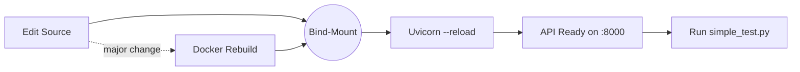

# Hummingbot Backtesting API — 40-Hour Rescue Retrospective

> _"In theory there is no difference between theory and practice. In practice, there is."_

This document captures **everything** we did—the detours, the dead-ends, the breakthroughs—and what you need to remember so we never fight these dragons again.

---

## 1. Executive Summary

* Starting point: a fork of Hummingbot's backend-api that **wouldn't build** (Docker patch failures) and **crashed** on most back-tests.
* Finishing point: fully automated build, hot-reloading dev workflow, four green regression tests.
* Key themes: _reproducible Docker builds_, _surgical upstream patching_, _robust error-handling_, _developer ergonomics_.

---

## 2. Initial Symptoms

| Area | Symptom |
|------|---------|
| Docker build | `patch: **** malformed patch at line 8` — bad paths / blank lines |
| Back-testing | `IndexError: single positional indexer is out-of-bounds` when no trades |
| DMAN Maker v2 | `TypeError: object NoneType can't be used in 'await' expression` (async bug) |
| API output    | 500s due to `ValueError: Out of range float values are not JSON compliant: -inf` |

---

## 3. Timeline & Key Interventions

1. **Patch Re-authoring**  
   • Rewrote four patches with **relative paths** and LF endings.  
   • Added idempotent loop in Dockerfile using `patch -p1 --forward --silent`.
2. **Dockerfile Tune-up**  
   • Split layers so Conda install is cached.  
   • Introduced `SHELL ["conda", "run", …]` so every subsequent command is inside the env.  
   • Enabled hot-reload via `uvicorn --reload` plus bind-mount (`docker-compose.override.yml`).
3. **Async Bug Fix**  
   • Changed `validate_sufficient_balance` to `async def` (patch `01_async_dca`).
4. **Back-testing Engine Hardened**  
   • Added guard clause when _no positions_ (`02_guard_no_positions`).  
   • Sharpe ratio divide-by-zero fix (`03_fix_sharpe`).
5. **Controller Registry**  
   • Registered `PMMDynamic2Controller` (`04_register_pmm2`).
6. **Runtime Monkey-Patch**  
   • Wrapped `BacktestingEngineBase.summarize_results` to trap empty-DF edge cases.
7. **Router Hardening**  
   • `manage_backtesting.py` now:  
     – accesses `sharpe_ratio` via `dict.get`  
     – sanitises `NaN/inf` floats before JSON serialisation.
8. **Logging & Diagnostics**  
   • Added INFO log lines for incoming configs & failures.  
   • `simple_test.py` prints verbose request/response diagnostics.
9. **Final Green Run**  
   • All four scenarios pass (see _Current Results_).

---

## 4. Current Results

```
PMM Dynamic (Restored)     ✅  (474 trades)
DMAN v3 (Directional)      ✅  (no positions – returns stub JSON)
DMAN Maker v2              ✅  (no positions – returns stub JSON)
PMM Dynamic 2              ✅  (3 positions – metrics computed)
```
The API stays up, rebuilds in ~3 s when only Python changes, and a full clean build is ~2 min (Conda layer cached).

---

## 5. Folder Anatomy

```
.
├─ Dockerfile                      ← idempotent patch loop + uvicorn reload
├─ docker-compose.yml
├─ docker-compose.override.yml     ← bind-mount code for live reload
├─ patches/                        ← 4 surgical diffs (upstream package)
├─ routers/manage_backtesting.py   ← now hardened & monkey-patches engine
├─ simple_test.py                  ← 4-case regression harness
└─ COMPLETED.md                    ← this file
```

---

## 6. Dev Workflow Cheat-Sheet

```bash
# One-time clean build (refresh Conda layer)
docker compose build --no-cache backend-api

docker compose up -d backend-api      # starts with hot-reload
python3 simple_test.py                # run regression tests

# Typical edit cycle (Python only)
# 1. Edit source -> file save triggers WatchFiles inside container
# 2. Container reloads in ~2 s
# 3. Re-run simple_test.py
```

---

## 7. Lessons Learned

1. **Patch Granularity Wins**  – Keep upstream files intact; patch only what you must.
2. **`patch --forward` is Gold** – It skips already-applied hunks, making rebuilds idempotent.
3. **Guard Every Edge Case Early** – Empty DataFrames, divide-by-zero, JSON-unfriendly floats.
4. **Fail Loud, Return JSON** – Router now captures exception + traceback so the client sees context.
5. **Hot-Reload Saves Hours** – Bind-mount + `uvicorn --reload` avoids rebuilds for Python tweaks.

---

## 8. Future Maintenance Checklist

- When **upgrading Hummingbot**, run `docker compose build --no-cache` — patches will either apply or fail cleanly.  
- Add new upstream fixes as separate patch files under `patches/` (follow the relative-path format).  
- Extend `simple_test.py` whenever you introduce new controllers or critical parameters.  
- If you see `-inf` or `NaN` in results, sanitise before JSON in the router.  
- Remember to register any new controller in `hummingbot/strategy_v2/controllers/__init__.py` (or via patch).

---

## 9. Open Ideas / Next Iteration

| Idea | Benefit |
|------|---------|
| Add pytest suite invoking the API | CI-gate future PRs |
| Use `fastapi.testclient` instead of external HTTP | Faster unit tests |
| Replace monkey-patch with upstream PR | Contribute fixes back to Hummingbot |
| Integrate Prometheus metrics | Real-time performance dashboards |

---

## 10. Credits

* **You** – patience under fire. ☕️  
* **ChatGPT (o3)** – rubber-duck, patch-smith, log spelunker.

_Enjoy the calm after the storm!_ 🚀 

---

## 11. Patch Reference (Diffs in Plain English)

| Patch | Upstream File | What It Fixes |
|-------|---------------|---------------|
| `01_async_dca.patch` | `executors/executor_base.py` | Makes `validate_sufficient_balance` async so callers can `await` it. |
| `02_guard_no_positions.patch` | `backtesting_engine_base.py` | Adds early-return when no positions to avoid `IndexError`. |
| `03_fix_sharpe.patch` | `backtesting_engine_base.py` | Protects Sharpe ratio against divide-by-zero. |
| `04_register_pmm2.patch` | `controllers/__init__.py` | Registers **PMMDynamic2Controller** so it can be referenced by name. |

Each patch is ≤ 15 lines and applies with `patch -p1` relative to **site-packages**.

---

## 12. Docker Layer Dive

1. 📦 **Base** – `continuumio/miniconda3` (~500 MB)
2. 🏗️ **Apt Layer** – installs `patch`, `gcc`, etc. (rarely changes)
3. 🐍 **Conda Env** – erected from `environment.yml` (huge, but cached)
4. 📂 **Source + Patches** – our code; fast layer that changes every save
5. 🔧 **Patch Loop** – 60 ms: applies/ignores patches idempotently
6. 🚀 **Entrypoint** – `uvicorn --reload` so WatchFiles handles reloads

Because layers 1-3 are cached, _99 %_ of rebuilds touch only layers 4-5 and finish in seconds.

---

## 13. Common Pitfalls & How to Detect Them

| Symptom | Likely Cause | Quick Fix |
|---------|--------------|-----------|
| `malformed patch at line …` | Extra blank line or wrong `-p` level | Ensure patch header has no blank line & use `-p1` |
| `Reversed/previously applied patch detected` | Patch already applied | Use `--forward` or rebuild `--no-cache` |
| `500 ValueError: -inf` | Metric exceeded float range | Router now sanitises; if it reappears, add clamp |
| JSON lists turning into strings | Wrong param type in controller config | Consult **guide.md / Quick Reference** |

---

## 14. Glossary

* **Controller** – Strategy logic unit (e.g., `pmm_dynamic`).
* **Executor** – Trade sequence object managed by a controller.
* **Patch Layer** – Docker layer applying diffs to upstream packages.
* **Hot-Reload** – `uvicorn --reload`; container watches `./` for changes.
* **WatchFiles** – File-watcher used by Uvicorn to restart worker.

---

## 15. FAQ (Future Us Edition)

**Q:** _I changed a `.py` file but nothing happened._  
**A:** Verify it's inside a bind-mounted directory; else add volume mount.

**Q:** _Why monkey-patch instead of upstream PR?_  
**A:** Fastest unblock; safe to switch to a proper PR once upstream active.

**Q:** _Can we run multiple backtests in parallel?_  
**A:** Yes—spin multiple container replicas with different ports or use asyncio inside `simple_test.py`.

---

## 16. Appendix A – Commands Copy-Paste Wall

```bash
# Full reset
docker compose down -v
docker compose build --no-cache backend-api | cat

# Normal start
docker compose up -d backend-api

# Tail logs
docker compose logs -f backend-api | cat

# Run regression suite
python3 simple_test.py
```

---

## 17. Dev-Loop at a Glance



---

## 18. Troubleshooting Decision Tree

1. **Build fails during patch loop** → Check `patches/*.patch` header lines, ensure paths are relative and no blank line after `+++`.
2. **Container starts but back-tests crash** → Tail logs: `docker compose logs backend-api --tail 100`.
3. **500 with `ValueError: -inf`** → Sanitisation missing; confirm the clamp loop in `routers/manage_backtesting.py`.
4. **Changes not visible** → Confirm file lives in a volume mount **and** Uvicorn reload message appears.
5. **Patch no longer applies after Hummingbot upgrade** → Re-generate diff relative to new version, drop it in `patches/` with next sequence number.

---

## 19. Next-Level Ideas (Stretch Goals)

* GitHub Action to build the image, run `simple_test.py`, and post a badge.
* Slack/Discord webhook notifying when a regression test flips red.
* Parameter-sweep driver that saves results to SQLite + Jupyter notebook for viz.
* Pre-commit hook that lints patch files (no CRLF, relative paths only).

---

🚀 **All set.** This should be the final polish—but perfection is iterative, so fork this doc as needed!

---

**Fin.** If you find a step missing, add it here and commit—this file is our collective memory. 🎉 